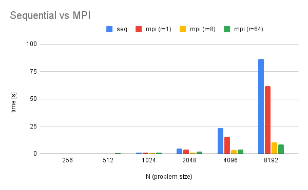
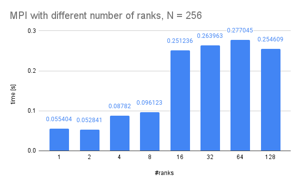
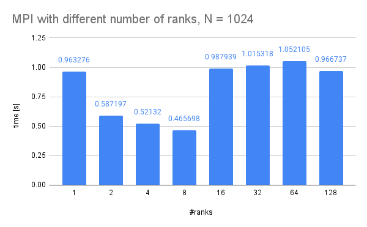
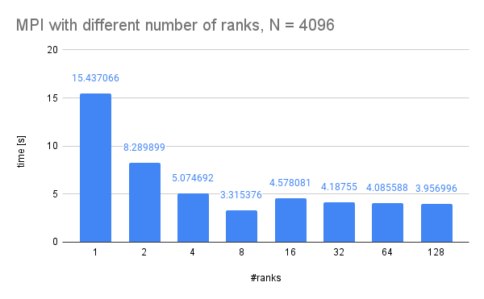

## Exercise 2 (2 Points)

> A sequential implementation of a 1-D heat stencil is available in heat_stencil_1D_seq.c. Read the code and make sure you understand what happens. See the Wikipedia article on Stencil Codes for more information.

See `heat_stencil_1D_seq.c`.

> Consider a parallelization strategy using MPI. Which communication pattern(s) would you choose and why? Are there additional changes required in the code beyond calling MPI functions? If so, elaborate!

Problem: We want to parallelize the sequential heat stencil implementation using multiple processor cores on potentially different nodes (NUMA). Using more processing power should lead to faster execution. For efficiency, we want to limit communication (over the network) as much as possible.

Approach: We logically split the entire array into R sub-arrays, where R is the number of MPI ranks. For each time step of the simulation, each rank propagates the heat on its local array, similar to the sequential implementation of the heat stencil. However, to correctly propagate the heat over the border of two neighbouring arrays/ranks, they have to be exchanged after each time step. This is done using a combination of MPI_Send and MPI_Recv operations on all ranks to their respective neighbours. To collect the sub-arrays and merge them into the original array, one rank is appointed the root rank which merges them using MPI_Gather. This happens every k-th step for an intermediary result, as well as after the simulation is finished.

Additional code other than MPI functions:
* Initialization and clean up of MPI resources.
* The heat source has to be set on the correct sub-array/rank.
* To reduce code duplication and potentially increase performance, the size of the sub-array for each rank is S = N / R + 2, where N is the problem size and R is the number of ranks. The additional 2 entries are used to map the values of the left and right neighbours into a ranks local memory. When the border tiles are exchanged, the right-most tile of a ranks left neighbour is stored in A[0], and the left-most tile of the right neighbour is stored into A[S-1]. Local heat propagation is then performed from tile A[1] to A[S-2]. That way, we do not have to check if "we are at the edge". However, when using MPI_Gather, one has to make sure to start fetching from A[1] and not include A[S-1].

> Implement your chosen parallelization strategy as a second application heat_stencil_1D_mpi. Run it with varying numbers of ranks and problem sizes and verify its correctness by comparing the output to heat_stencil_1D_seq.

See `heat_stencil_1D_mpi.c`.
See `results/`.
See `img/`.

> Discuss the effects and implications of your parallelization.

Observations:

* The MPI implementation using a single rank is faster than the sequential implementation.
* When using <= 12 ranks, using more ranks is almost always faster. In this case, doubling the number of ranks approximately halves the computation time, but diminishes with the number of ranks. However, for small problem sizes (N=256), the best performance is achieved using a single rank. In this case, the communication overhead is worse than the additional performance gain. Maybe there are also caching inefficiencies. The larger the problem size, the less noticeable the communication overhead.
* When using more than 12 ranks, there is at least one rank placed on another node. In this case, communication over the network is necessary, which slows down the overall computation, as there is implicit synchronization at each step in simulation time. This is most noticeable when using 16 ranks, which is in all cases slower than using 8 ranks. When using more than 24 ranks (at least 3 nodes), is not that noticeable, but there is little to no performance gain.
* The optimal number of ranks seems to be 8 (or maybe 12).
* We predict, that if we were to implement a 2D or 3D heat stencil, using more ranks would be much more efficient, as there is more computation per "unit of communication".