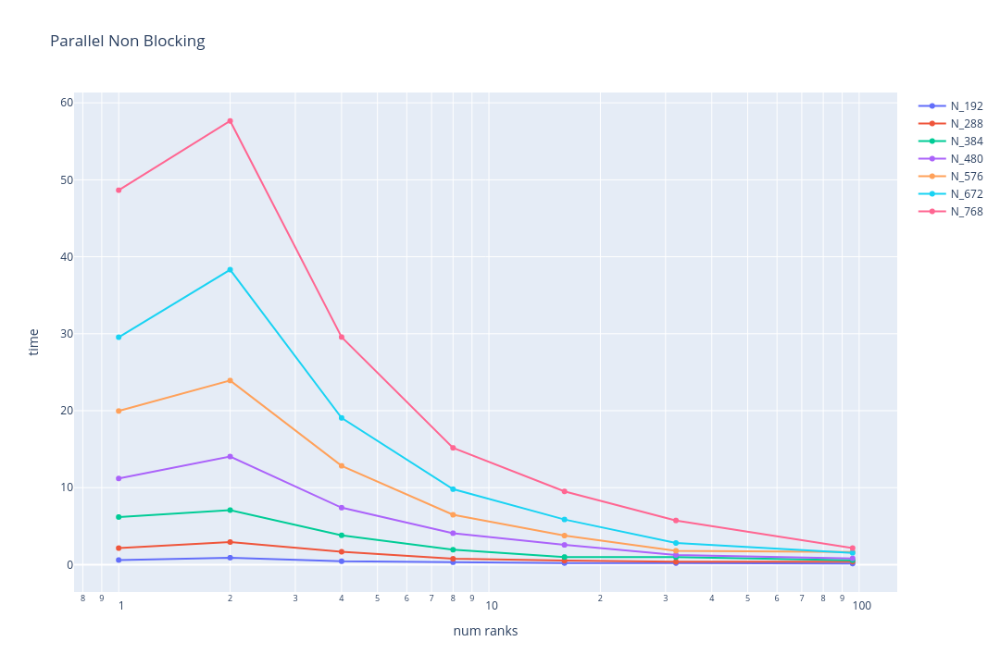
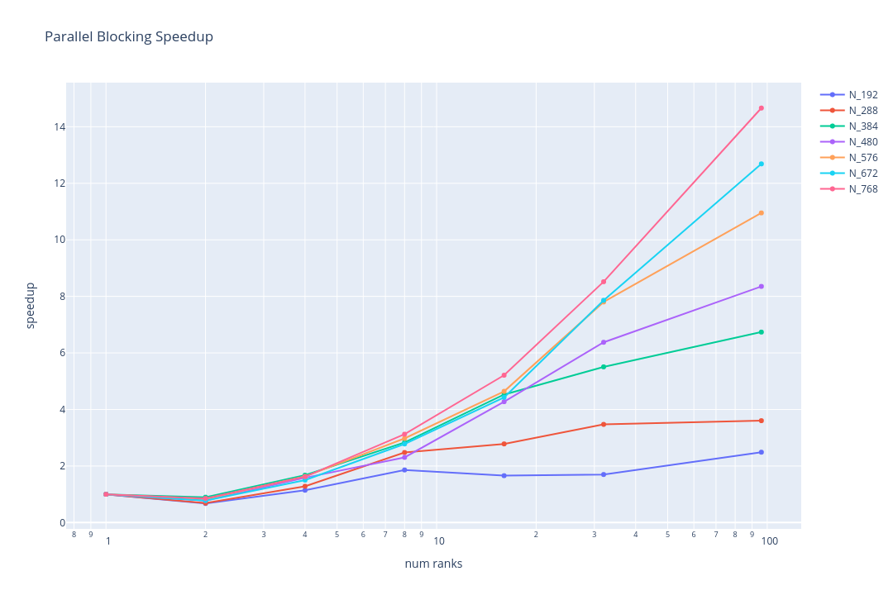
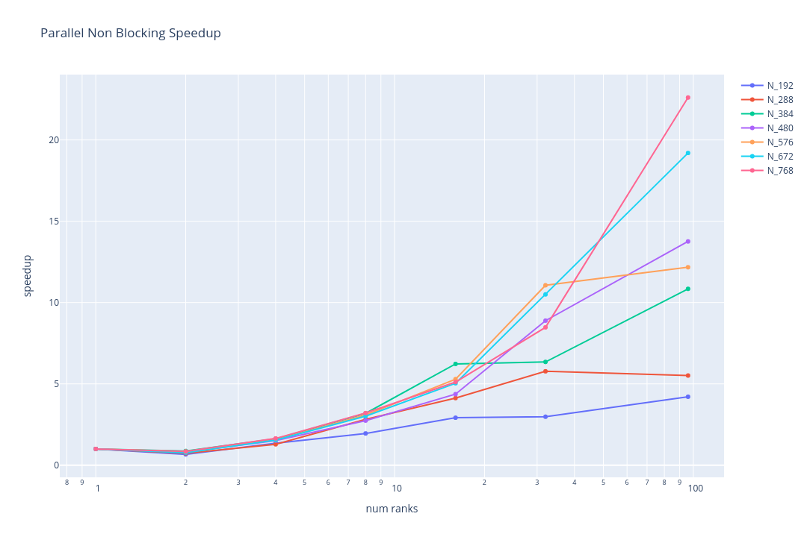

### Team: Peter Burger, Leo Schmid, Fabian Aster

# Exercise sheet week 03

## Exercise 01

**Run your programs with multiple problem and machine sizes and measure speedup and efficiency. Consider using strong scalability, weak scalability, or both. Justify your choice.**

For the parallel program with blocking functions 8 ranks seem to be a good choice. Even for small problem sizes like 384 a strong decrease in the computation time up to this amount of processes can be observed.

The same applies for the parallel program with non-blocking functions. Even the overall numbers are smaller, the curve within the graph does not change.

Depending on the problem size the speedup is for all tested number of ranks huge. For the largest problem size `N=768`the parallel programm running on 96 cores is 50 times faster than the sequential programm. Without a doubt the relative speedup decreases with the increasing number of cores. Running on 32 cores is still 30 times faster than the sequential programm, even if it only takes up a third of the resources comparing to running on 96 cores.

The measurements for the non-blocking parallel program are not as consistent as for the program with blocking functions. Therefore it is difficult to evaluate the graph. Assuming we trust the numbers, the limit of performance increase by multiple processors is already reached after 32 processors for most problem sizes.

The efficiency is between 10% and 40%. For bigger problem sizes there is no tipping point recognizable. For problem sizes below 288 8 ranks is the last step before the efficiency drastically decreases.

Same problem as before. The measurements for the non-blocking parallel program are not as consistent as for the program with blocking functions. Therefore it is difficult to evaluate the graph. 

**Measure and illustrate one domain-specific and one domain-inspecific performance metric. What can you observe?**

Domain specific:

Domain inspecific:

Domain-specific is more descriptive and it is easier connect that size to the acutal problem. Therefore this seems to be a more intuitive and easier to understand measure.
Domain-specific can be used to compare different programs, but in most cases it is too "abstract" to derive meaningful information from it.
In our case the Domain inspecific scales a lot with the N (ca N³), while the specific scales linearly with N. Therefore in our graphes in the inspecific, the program seems to be doing a lot better with higher Ns. 

**How can you verify the correctness of your applications?**

Print the 2D heat stencil for every 10.000 timestamp and compare if with the sequential version.

