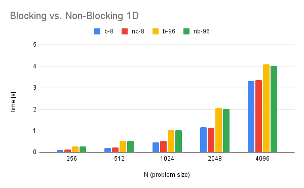
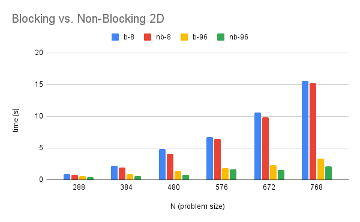

## Exercise 2 (1.5 Points)

> Provide an MPI implementation for the 1D and 2D heat stencil that uses non-blocking communication. If you already implemented a non-blocking version, provide a blocking version, but ensure the non-blocking version works as described below.

> Structure your program such that you 1) start a non-blocking ghost cell exchange, 2) compute the inner cells which do not require the result of the ghost cell exchange, 3) block until the ghost cell exchange has finished, and 4) compute the remaining cells.

See `heat_stencil_1D_mpi_np.c`.
See `heat_stencil_2D_mpi_np.c`.

> Run your programs with multiple problem and machine sizes and compare both versions.

#### 1D heat stencil

Observations:

* There is almost no difference when using 8 cores.
* When using more cores, the non-blocking variant performs better than the blocking version, but only marginally. A reason for that could be the fact that in the 1D heat stencil application, there is not a lot of data being transferred. In that case, the time in blocking state is almost negligible.

#### 2D heat stencil

Observations:

* Non-Blocking is faster in all cases.
* The speed-up is larger the more cores are used. This makes sense, since using more cores result in faster computation of the cells and thus communication becomes the bottleneck.

> Insert wall time for 96 cores for N=768x768 and T=N*100 into the comparison spreadsheet: https://docs.google.com/spreadsheets/d/18WIigEWPM3htroCkLbLoiVKf2x4J2PtxDbtuYUPTRQQ/edit