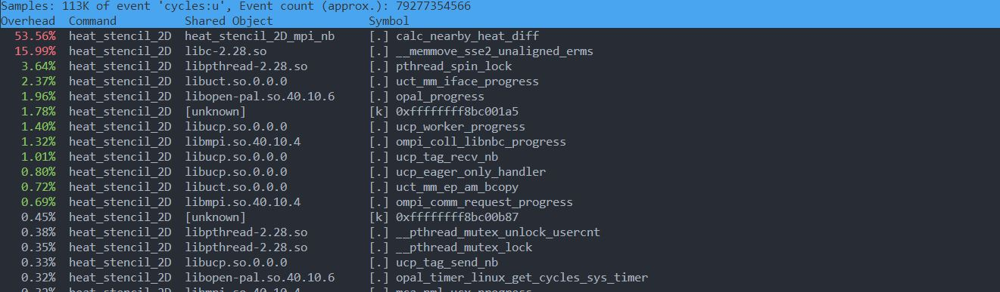

### Team: Peter Burger, Leo Schmid, Fabian Aster

# Exercise sheet week 03

## Exercise 01

**Do a detailed performance analysis on your 1D and 2D heat stencil implementation. Use either tools discussed in the lecture (perf, gprof, gperftools, etc.) or any tools you deem fit for generating a performance profile.**

**Provide a report that discusses the most expensive source code locations ("hot spots") along with explaining why they are expensive and how to possibly improve on that. Compare blocking and non-blocking if possible, as well as 1D and 2D.**

#### Tools considered

* *gprof*: We had some trouble setting up gprof. Also, after some research, we found that `gprof` is no longer suitable for modern-day applications and that you should use something else (See https://gernotklingler.com/blog/gprof-valgrind-gperftools-evaluation-tools-application-level-cpu-profiling-linux/, https://stackoverflow.com/questions/1777556/alternatives-to-gprof).

* *perf*: We mainly used `perf`, as it seems to be the most capable and the most convenient.

#### Approach

To get an overall understanding of how the different implementations bahave on different problem sizes and ranks, we ran `perf` a couple of times.

MPI Blocking, R=2, N=192

MPI Blocking, R=2, N=786

MPI Blocking, R=2, N=192

MPI Blocking, R=2, N=786

MPI Blocking, R=2, N=192

MPI Blocking, R=2, N=768

We can see, that there are mainly two optimization concerns. The `compute_nearby_heat_diff` function, which updates the cells based on its neighbours, and the MPI communication (several other functions listed, such as `spinlock`, `memmove`, ...). The initialization functions and printing can be ignored, as they appear to have almost no impact on performance.

When we zoom into `compute_nearby_heat_diff`, we can see that almost all of the computation happens in the statement `B[IND(y, x)] = tc + 0.2 * (tr + tl + td + tu - (4 * tc));` (Note: the compiler "in-lines" the computation of tc, tr, ... here):

TODO

**Consider improving your 2D stencil using the gathered information. If you do, document the improvement you managed to achieve. If you don't, argue why the application performance cannot be feasibly improved in your opinion.**

Step 0 - Improve Code Base:

* *Restructure Code Layout*: To make our code base more manageable, we did the following:
    * make sure that file names are consistent and meaningful
    * move the source code into the src/ directory
    * compile the binaries into the bin/ directory
    * outsource duplicate code used in multiple implementations into respective header files
        * `src/common/common1d.h`
        * `src/common/common2d.h`
    * adjust the Makefile accordingly
        * use mpicc from `module load openmpi/3.1.6-gcc-12.2.0-d2gmn55`
        * to build all, run `make`
        * to clean all, run `make clean`
* *Consistent Code Formatting*: To make the source code more consistent and improve readability, we use `clang-format`. To run clang-format, first load the module from `module load llvm/15.0.4-python-3.10.8-gcc-8.5.0-bq44zh7`. Then, to format all the source code in the project, run the script `bash format.sh`.
* *Consistent Benchmarking*: To simplify benchmarking, reduce the manual execution of multiple tasks, and ease the administration overhead for the benchmark results, we developed a small "benchmark suite". To benchmark multiple tasks, one can use the `benchmark.sh` script. First, adjust your parameters in the script (executables, ranks, problem sizes), then run the script using `bash benchmark.sh`. The script will then create and run SLURM jobs for each combination of parameters. The results are stored under `benchmarks/<ts>/<executable>_<ranks>_<problemsize>.out`, where `ts` is the UNIX time in seconds when the benchmark was executed and `executable`, `ranks` and `problemsize` are a combination of parameters given in the script. Similarly, there is also a script `benchmark-perf.sh` to run single SLURM jobs in combination with `perf`. After running it, use `perf report` to inspect the results.
* *Improve Reproducibility*: To improve reproducibility, we implemented most of the common workflows using bash scripts and documented their usage accordingly:
    * `make`
    * `make clean`
    * `bash format.sh`
    * `bash benchmark.sh`
    * `bash benchmark-perf.sh`

Step 1 - Improvements to `compute_nearby_heat_diff`:

To reduce the number of operations required to compute `B[IND(y, x)] = tc + 0.2 * (tr + tl + td + tu - (4 * tc));`, we shortened it to `B[IND(y, x)] = 0.2 * (tr + tl + td + tu + tc)`. Although we thought that this change would be done by the compiler automatically, this was not the case. We achieved a speed up of about 1.15 to 1.20. However, one could still argue if this solution is really better, as for different heat coefficients the code has to be rewritten.

We also tried using the `-fast-math` flag of the `gcc` compiler, but the improvements seem to be negligible.

Different approach to improve compute_nearby_heat_diff even further:

Since this function consists of a lot of floating point operations, that handle `*4` and `*0.2` we thought that it might speed the process up, if we
convert them to int, and change the `*0.2` to `*0.25`. 
This changes the heat coefficient wich might not make sense in a real Simulation but should have improved the performance a lot.
So we changed the double to u_int64_t, and used 2 bytes for the numbers, and 2 bytes for the comma values.
This is simply done by multiplying and dividing the double value by `2^32`.
With int the big hope for improvement came from exchanging `x * 0.25` to `x << 2` and `x*4` to `x >> 2`.
But in the end the measurements showed that this version takes about 2 sec to execute and is thereby by about 0.2 sec slower than
working with float number.

TODO

**Insert the final walltime and speedup of the 2D stencil for 96 cores for N=768x768 and T=768x768x100 into the comparison spreadsheet: https://docs.google.com/spreadsheets/d/18WIigEWPM3htroCkLbLoiVKf2x4J2PtxDbtuYUPTRQQ/edit**

TODO
