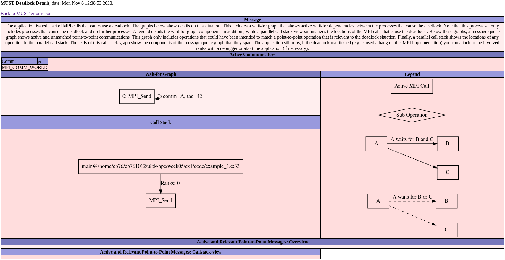
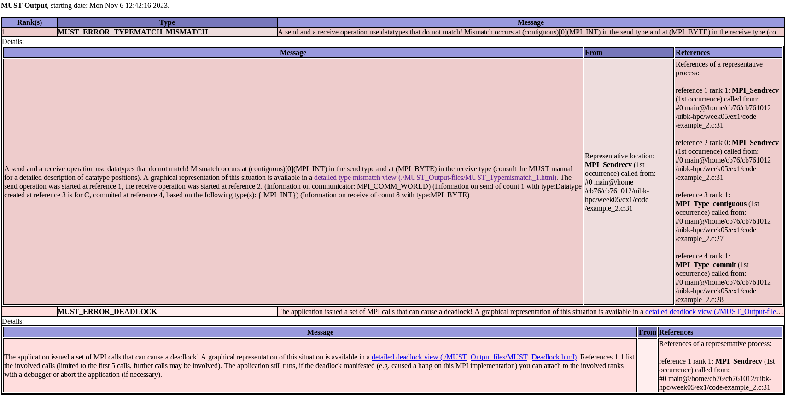
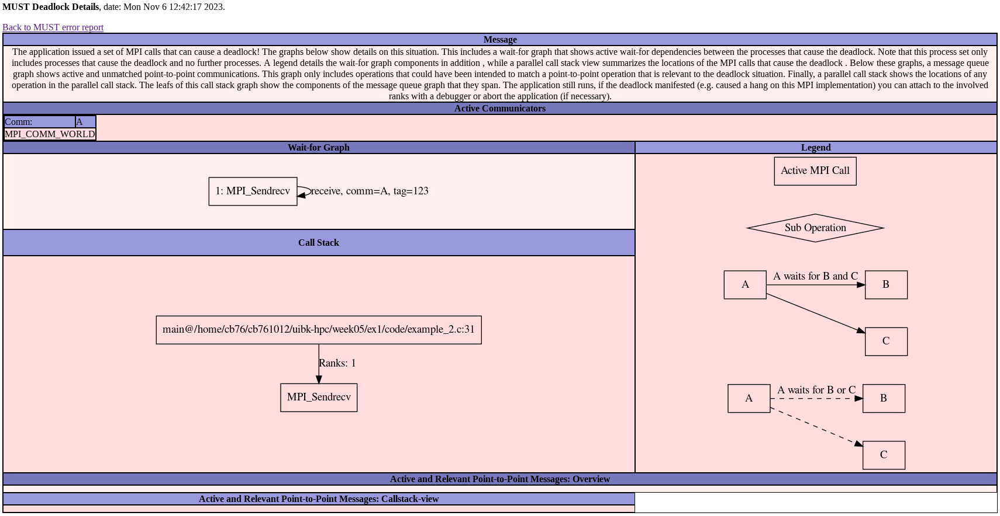

### Team: Peter Burger, Leo Schmid, Fabian Aster
# Assignment 5

The goal of this assignment is to try some MPI debugging.

## Exercise 1 (3 Points)

This exercise consists in comparing blocking and non-blocking communication for the heat stencil application.

### Tasks

- Take a look at the provided example codes.
- For each example code, run through the usual debugging workflow
    1) enable compiler warnings
    2) check with sanitizers
    3) run with a debugging tool of your choice (a working installation of MUST on LCC3 is provided in `/scratch/c703429/software/must-1.9.1`)
- Regardless of whether any of these steps highlights an issue, elaborate on the settings/parameters you used and what kind of errors they should detect!
- Report any bugs or issues that were found and attempt to fix them
- Is there anything else that can be done to highlight or avoid bugs?
- If available, use the same debugging workflow for one/some of your own implementations that exhibited strange behavior and see if you can spot any issues!

## Problems notices by executing the programs
Both code examples seem to run into a deadlock or something similar, since they dont finish.

## Enabling compiler warnings

To enable the compiler warnings we added the following flags to the compilation cycle.
This already showed two warnings, in example1 a unused variable and in example2 a assignment to a variable inside a function
call. So in example2 this leads definetly to a unexpected behaviour.

Added flags:
`-Wall -Wextra -pedantic`

Resulting warning from example1.c:
```
example_1.c: In function 'main':
example_1.c:13:9: warning: unused variable 'i' [-Wunused-variable]
   13 |     int i;
      |
```

Resulting warning from example2.c:
```
example_2.c: In function 'main':
example_2.c:32:28: warning: operation on 'rank' may be undefined [-Wsequence-point]
   32 |                      (rank = 1 + size) % size, 123, MPI_COMM_WORLD, &status);
      |
```

## Check with sanitizers

After fixing the issues of the compiler warinings and running the code after compiling with sanitizers it lead to no additional warnings/issues.
Flags for sanitizer: `-fsanitize=undefined,address `

After fixing all the issues, the sanitizers kept outputing the following errors,
that are caused by mpi itself.
More to this at the end of this file.

Errors:
```
Direct leak of 16384 byte(s) in 1 object(s) allocated from:
==2649803==ERROR: LeakSanitizer: detected memory leaks
    #0 0x154344fb9d77 in __interceptor_calloc /tmp/hpc-inst/spack-v0.19-lcc3-20230919-stage/spack-stage-gcc-12.2.0-p4pe45vebc7w5leppo2eeesyakewpbxf/spack-src/libsanitizer/asan/asan_malloc_linux.cpp:77
    #1 0x15433ca978f0 in mlx4_store_qp (/lib64/libmlx4-rdmav2.so+0x1a8f0)


Direct leak of 304 byte(s) in 2 object(s) allocated from:
Direct leak of 16384 byte(s) in 1 object(s) allocated from:
    #0 0x148e9441ed77 in __interceptor_calloc /tmp/hpc-inst/spack-v0.19-lcc3-20230919-stage/spack-stage-gcc-12.2.0-p4pe45vebc7w5leppo2eeesyakewpbxf/spack-src/libsanitizer/asan/asan_malloc_linux.cpp:77
    #1 0x148e8be978f0 in mlx4_store_qp (/lib64/libmlx4-rdmav2.so+0x1a8f0)

    #0 0x154344fba38f in __interceptor_malloc /tmp/hpc-inst/spack-v0.19-lcc3-20230919-stage/spack-stage-gcc-12.2.0-p4pe45vebc7w5leppo2eeesyakewpbxf/spack-src/libsanitizer/asan/asan_malloc_linux.cpp:69
    #1 0x15433ca8896d in mlx4_alloc_db (/lib64/libmlx4-rdmav2.so+0xb96d)
```

## Running with mustrun

### example1
Mustrun found 1 error in example1, and that is a deadlock.



So here is a deadlock, it arises from sending a message to itself, instead of sending it to the next rank.
Another bug was that the tags didnt match.

### example2
In example2 mustrun found two errors, one type mismatch and one deadlock.




Details about the type mismatch show the following graph:


Details about the deadlock look like this:



## Fixed Bugs

### example1

- removed tag2
- improved readability by adding brackets and reformatting
- fixed sending to itself
- fixed receiving from wrong tag

### example2

- fixed datatype from MPI_BYTE to MPI_INT
- replaced `(rank = 1 + size)` with `(rank - 1 + size)`
- fixed deadlock from communication of rec and send -> splitted that to `rank % 2`
- added `MPI_Type_free(&newType);` to prevent memory leak

## Debugging our 2D non-blocking heat stencil implementation

We already used compiler warnings in the previous implementation. So, we only tested using sanitizers. For that, we compiled our implementation with the an additional GCC flag `-fsanitize=address,leak,undefined`. Then, we executed the programm and checked the output. Although there were no problems with `address` and `undefined`, a lot of memory leaks were reported:

```
...

Direct leak of 16384 byte(s) in 1 object(s) allocated from:
Direct leak of 16384 byte(s) in 1 object(s) allocated from:
    #0 0x14c158b48d77 in __interceptor_calloc /tmp/hpc-inst/spack-v0.19-lcc3-20230919-stage/spack-stage-gcc-12.2.0-p4pe45vebc7w5leppo2eeesyakewpbxf/spack-src/libsanitizer/asan/asan_malloc_linux.cpp:77
    #1 0x14c1505978f0 in mlx4_store_qp (/lib64/libmlx4-rdmav2.so+0x1a8f0)

    #0 0x147ad47a5d77 in __interceptor_calloc /tmp/hpc-inst/spack-v0.19-lcc3-20230919-stage/spack-stage-gcc-12.2.0-p4pe45vebc7w5leppo2eeesyakewpbxf/spack-src/libsanitizer/asan/asan_malloc_linux.cpp:77
    #1 0x147acc2978f0 in mlx4_store_qp (/lib64/libmlx4-rdmav2.so+0x1a8f0)

Direct leak of 384 byte(s) in 6 object(s) allocated from:
Direct leak of 384 byte(s) in 6 object(s) allocated from:
    #0 0x14c158b4938f in __interceptor_malloc /tmp/hpc-inst/spack-v0.19-lcc3-20230919-stage/spack-stage-gcc-12.2.0-p4pe45vebc7w5leppo2eeesyakewpbxf/spack-src/libsanitizer/asan/asan_malloc_linux.cpp:69
    #1 0x14c1582e3cb4 in ompi_attr_create_keyval_impl (/usr/site/hpc/spack/v0.19-lcc3-20230919/opt/spack/linux-rocky8-westmere/gcc-12.2.0/openmpi-3.1.6-d2gmn55g7hoinwfuk2lc3ibz6odzujak/lib/libmpi.so.40+0x56cb4)

...
```

On closer inspection, they appear to be come from third-party applications, or from MPI itself, and not directly from our code. Just to be sure, we moved the `MPI_Finalize()` to the very end, just before the return statement in the main function (as reccomended in https://www.mpich.org/static/docs/v3.1/www3/MPI_Finalize.html). This did not solve the memory leaks.

After doing some research, this appears to be quite common. They are often considered to be "false-positives":

* https://stackoverflow.com/questions/8471773/mpi-memory-leak
* https://github.com/open-mpi/ompi/issues/10048
* https://stackoverflow.com/questions/52096355/leaksanitizer-finds-leak-in-simple-mpi-program
* https://www.open-mpi.org/faq/?category=debugging#valgrind_clean

Mustrun somehow always got stuck on MPI_Init in our heat stencil implementation.
