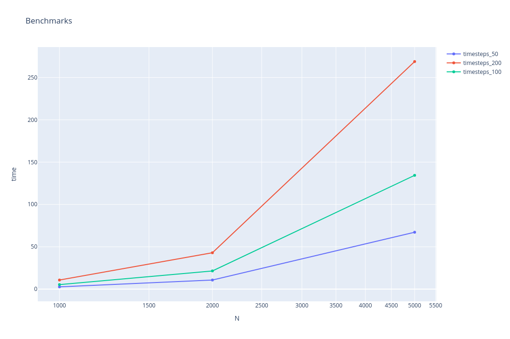

### Team: Peter Burger, Leo Schmid, Fabian Aster
# Assignment 5

## Exercise 1

Our serial implementation run with the following benchmarks:

You can see here, that it scales linearly with the timestemps,
but seems to scale with O(n²) with the particle count, which makes sense since all particle effect each other.

## Exercise 2 (1 Point)

### Description of the Problem

The N-body problem is a common simulation pattern in scientific computing. Generally speaking, it models a time-evolving system, in which every element continuously updates its state based on the interaction between itself and every other element in the system. This is in contrast with stencil applications, where the interaction only happens between elements in close proximity. In terms of parallelization, this thus requires a different approach:

* Since, for each element, we have an interaction with every other element, there is no inherent link between performance and geometric location of the element in a system (as opposed to stencil applications).

* To update the state of an element, we will eventually need the previous state of every other element. Thus, when parallelizing, we need a mechanism to distribute the local results over multiple ranks.

### Optimization opportunities for the Sequential Approach

Some suggestions:

* Simplify the math. Check if some terms cancel out.
* Try array-of-structs vs. struct-of-arrays.

### Parallel Approaches

To improve simulation performance, we want to parallelize our N-body problem using MPI. Essentially, we want to efficiently distribute the work over multiple ranks, and at the same time reduce the communication overhead as much as possible.

Similar to stencil applications, we argue that it would be a sensible approach to assign each rank a subarray of the entire system.  Every rank is then responsible for updating the state of its assigned elements at every step in time. However, to update the elements, we require the previous states of the elements on the other ranks. For that, we need a sensible communication pattern.

### Parallel Approach 1: Central Communication

The simplest solution we could come up with is the following: A single rank is chosen that, at the end (or start) of every time step, collects the local results of the other ranks, merges them, and redistributes the merged state to the other ranks.

Useful MPI commands:

* MPI_Gather: used to collect the local results
* MPI_Bcast: used to send and receive the collected state

Pros:

* Simple and straight forward
* Not a lot of adjustments from the sequential application
* Few, but bulky send/receive operations. Might be more efficient than many, small send/receive operations

Cons:

* No latency hiding
* Overloaded communication rank, which results in busy waiting of the other ranks

### Parallel Approach 2: Mesh Communication

As a second approach, one could consider using some kind of mesh communication to distribute the local states. At the end (or beginning) of every time step, every rank broadcasts their local results to every other rank. In that case, we could also use non-blocking communication and latency hiding: We first start a non-blocking send of the local states to every other rank, update the local elements using the old local state, and then continuously wait for the states of the other ranks and update the elements accordingly.

Useful MPI commands:

* MPI_Bcast/MPI_Ibcast: Used to broadcast the local state. But maybe we have to use regular non-blocking send/recv operations.
* MPI_Waitany: Used in a loop to continuously fetch the available states of the other ranks. In the loop body, we update the local elements using the received states.

Pros:

* Latency hiding
* Smaller exchanges
* Equal distribution of work

Cons:

* More complex communication
* More exchanges

### Additional considerations

* Do we have to send the entire state (all properties of the elements, or is position enough)?
  
* There is a symmetry between the forces acting on two particles: `F_ij = -F_ji`. Currently, we compute them twice, which is redundant. Maybe there are some interesting communication patterns such that we only have to compute half of the forces and can reconstruct the other half.

* How much do long distances affect the forces? Are there cases where two particles are so far apart that the force between them is negligible? In that case, we could omit computation.
