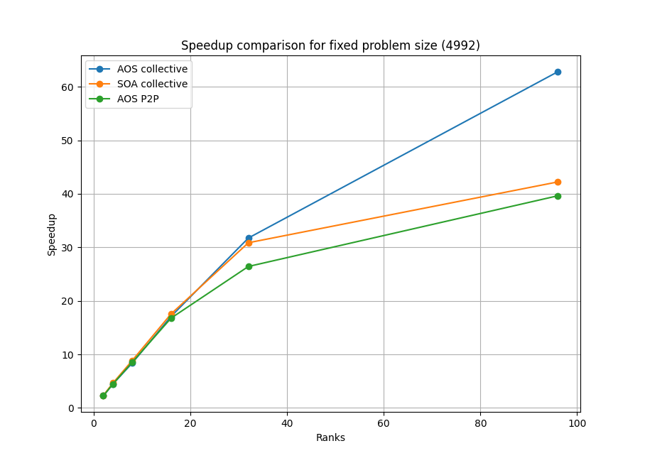
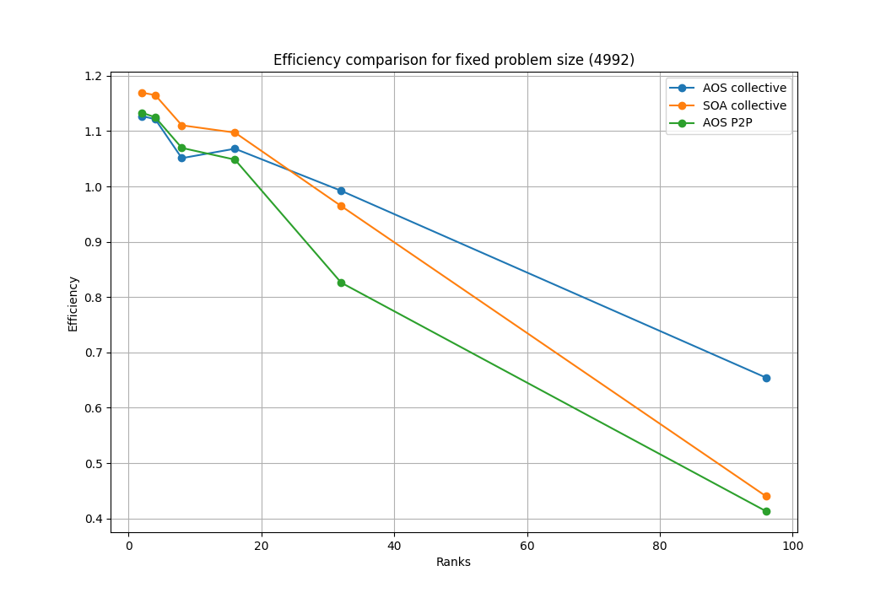
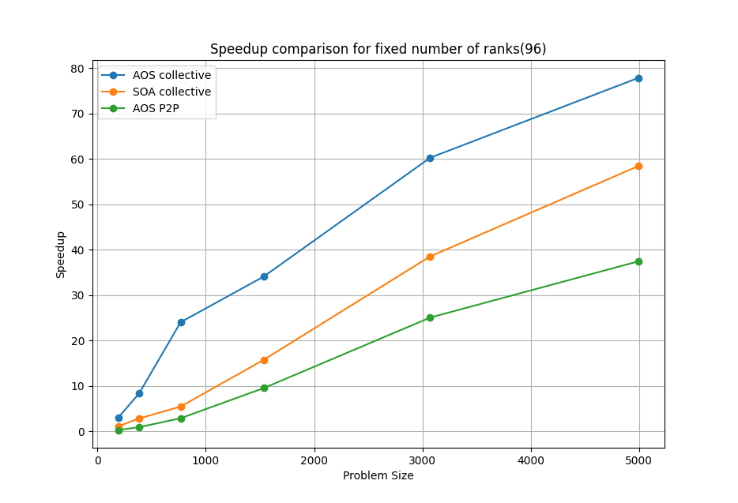
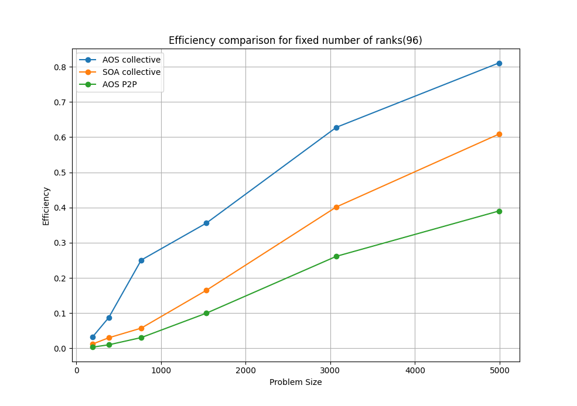
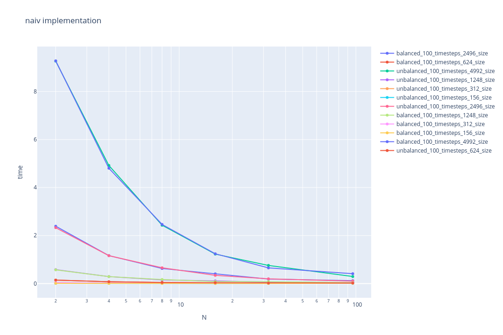

### Team: Peter Burger, Leo Schmid, Fabian Aster, Marko Zaric
# Assignment 7

## Exercise 1

We have 3 different implementations, two collective_mpi that work with a simple mpi_brodcast, one of them uses a AOS and one a SOA.
The third approach uses point to point communication, so not everything is gathered in one rank and redistributed, but the individual ranks communicate between each other to update the positions.

We compared the speedup and efficiency of our implementations in two different scenarios. First we measure the speedup with a fixed problem size (4992) and changing ranks:

Secondly we looked at the speedup for a fixed number of ranks (96) and while varying the problem size:

Looking at these graphs we clearly observe, that all our three implementations have a certain sweet spot where the problem size is great for the selected number of ranks. In the varying problem size comparison we see that the increase in particles benifits the efficiency and speedup. This would indicate that our bottleneck is the communication in all three implementations. Further proof for this claim is the drop in efficiency for a constant problem size when increasing the ranks.

The Array of Structs implementation using MPI collectives outperforms both counterparts (Struct of Array with MPI Collectives) and the AOS P2P implementation across the board.

## Exercise 2

For exercise 2 the task was to modify the n-body simulation in order to introduce a spartual load imbalance. We created a benchmark measurement for our collective and p2p implementations in order to compare spartially unbalanced versus uniformly distributed particle initialization.

The following plot shows the direct visual comparison in runtime between the balanced and unbalanced initialization for the naive collective MPI implementation for various problem sizes (number of particles):

It is clearly observable that in this case the difference between balanced and unbalanced initialization is negegable (Two lines are always almost covering each other). This is supposed to be the case because there is nothing in the code which uses spartial information in order to speed up the runtime. The particles are shared across the ranks by index and not by spartial closeness. 

The next plot displays the direct visual comparison in runtime between the balanced and unbalanced initialization for the P2P MPI implementation for various problem sizes:

Again there is no signifcant difference between the two initialization schemes since this implementation again does not make use of spartial closeness between particles for runtime speedup. 

This way of implementing the n-body problem can be advantageous if the distiribution of particles is unknown or varies a lot in the specific use case because because the runtime is stable even with spartial imbalance which makes the completion time predictable. 

If the particles are close to uniformly spaced a lot of particles will have next to no influence when computing the next position for each individual particle. This fact can be used to potentially increase speedup but it is more suseptable to spartial inbalances which in turn will call for more involved techiques in order to mitigate these inbalances when sharing the computational load.