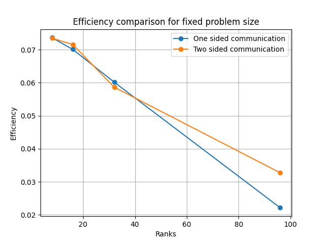
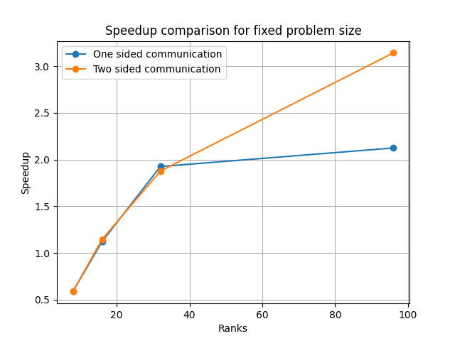
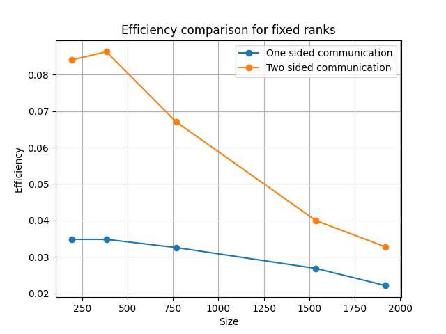
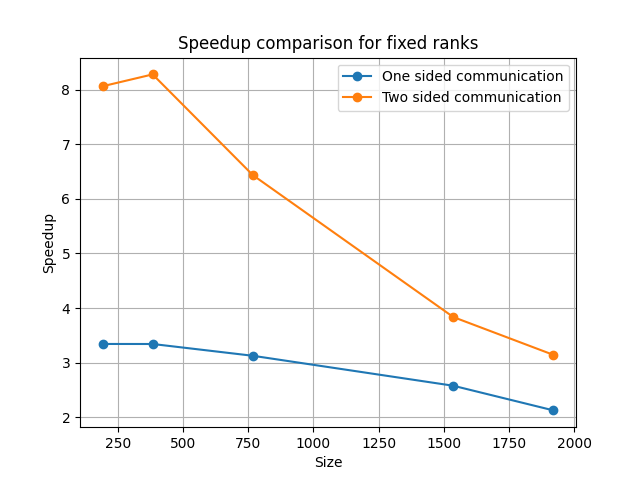
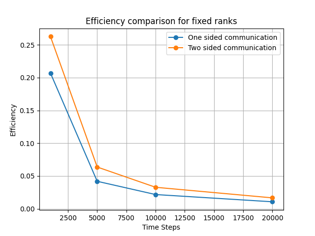
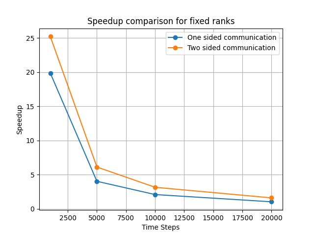

### Team: Peter Burger, Leo Schmid, Fabian Aster, Marko Zaric
# Assignment 8

## Exercise 1

We have 2 different implementations, one is using a simple array of structures and one sided communication in a collective manner. The second approach uses point to point communication, so not everything is gathered in one rank and redistributed, instead each ranks communicate between eaach other to update the positions of the particles. Velocity does not have to be shared between the ranks. The mass of the particles is distributed at the beginning of the simulation. Since it is constant over the execution of the program, it is not necessary to further update it.

We compared the speedup and efficiency of our implementations in three different ways. On one occasion we compare the speedup and efficiency of our implementations with changing ranks, while the problme size (1920) and the number of timesteps are fixed.

On the second occasion we observed the speedup and efficiency for a fixed number of ranks (96) and timesteps, while the problem size is increasing.

At last we compared the measurement for an increasing number of timesteps and 96 ranks computing the n-body simulation for a problem size of 1920.

First of all it is clear to say, that the program did any performance improvement from one sided communication. The opposite is actually the case. In most cases the curve of the one sided communication is similar to two sided communication, just slighty slower.

The computation complexity increases linearly with the number of timestamps, while it grows quadratic when increasing the problem size. 