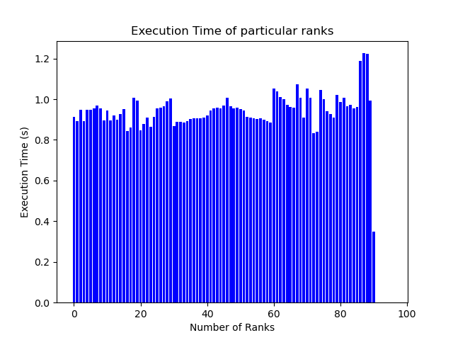
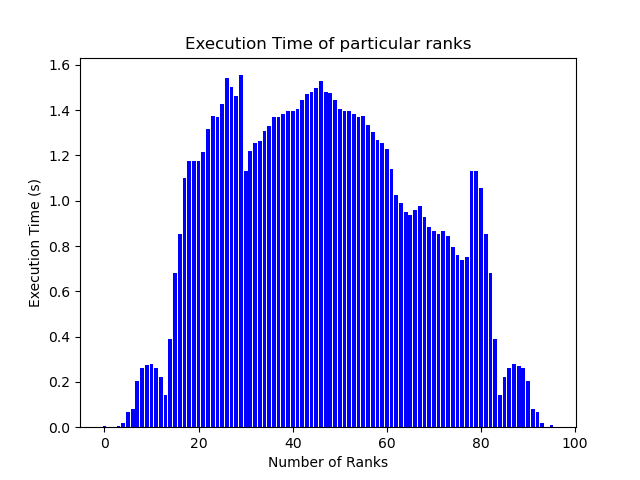
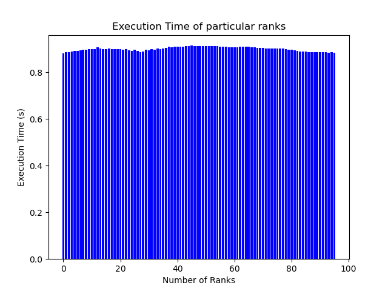

### Team: Peter Burger, Leo Schmid, Fabian Aster, Marko Zaric
# Assignment 10

## Exercise 1

## Exercise 2

For this exercise we tried two sample based static load balancing implementations. In both we subsampled a smaller image over the same domain in order to gain some knowledge of how the loads are distributed. In the frist one we defined a complexity metric and redistributed the loads based on that. For the second implementation we tried load balancing diffusion. 

### Sample based Complexity Estimation

### Sample based Load Diffusion

In this approach as in the previous one we first created a smaller mandelbrot set on the same domain (100 times smaller) in order to measure the computational load on each of the aquidistantly chosen sections. Afterwards we used used mass conserving numerical diffusion over the time measurements on the subsampled domain. Then we used the diffusion of time to guide the diffusion of grid points along the y-axis in order to move the first aquidistantly distributed points over ranks to move them to regions where less computiation was neccessary: 

$$\frac{\partial duration}{\partial t} = \Delta duration$$ 

$$duration^{t+1}_{rank} = duration^{t}_{rank} + 0.2*(duration^{t}_{rank-1} -2\cdot duration^{t}_{rank} + duration^{t}_{rank+1})$$ 

In order to guide the grid diffusion we uses the duration update move the grid points appropriately:

$$points^{t+1}_{rank} = points^{t}_{rank} + 0.001*\frac{duration^{t}_{rank-1} -2\cdot duration^{t}_{rank} + duration^{t}_{rank+1}}{\| duration^{t}_{rank-1} -2\cdot duration^{t}_{rank} + duration^{t}_{rank+1} \|}$$

For 5000 timesteps this yields a nice result for the duration diffusion but the parameter tuning (timesteps, diffusion coefficients) was hard to tune. The main issue was mass conservation for the particles which turns out is actually not easy for particle diffusion which is guided by a diffrent quatity. With some trial an error we got to a **speedup of 1.33** (around 2 was actually the best one could get since average execution time is 0.9 when calculating based on the unbalanced data). There are other more involved numerical methods in order to have mass conservation for the points (particles as well) but this was a bit to much overhead to be solvable in a week.  

### Simple and Stupid Sampling

A rather simple approch is to optimize the way the the complex plane of the Mandelbrot set is sliced instead of computing the complexity of the operations. The idea is that the array is sliced in many vectors and each rank is computing vectors from the very left to the very right of the plane meaning one rank does not compute the neighbour vectors. 

The downside is that (at least in the current implementation) each ranks holds the whole complex plane and is just indexing a few of them, which leads to inefficient memory usage of the single ranks. However, the bar plot shows how efficient the load is balanced between the ranks.

