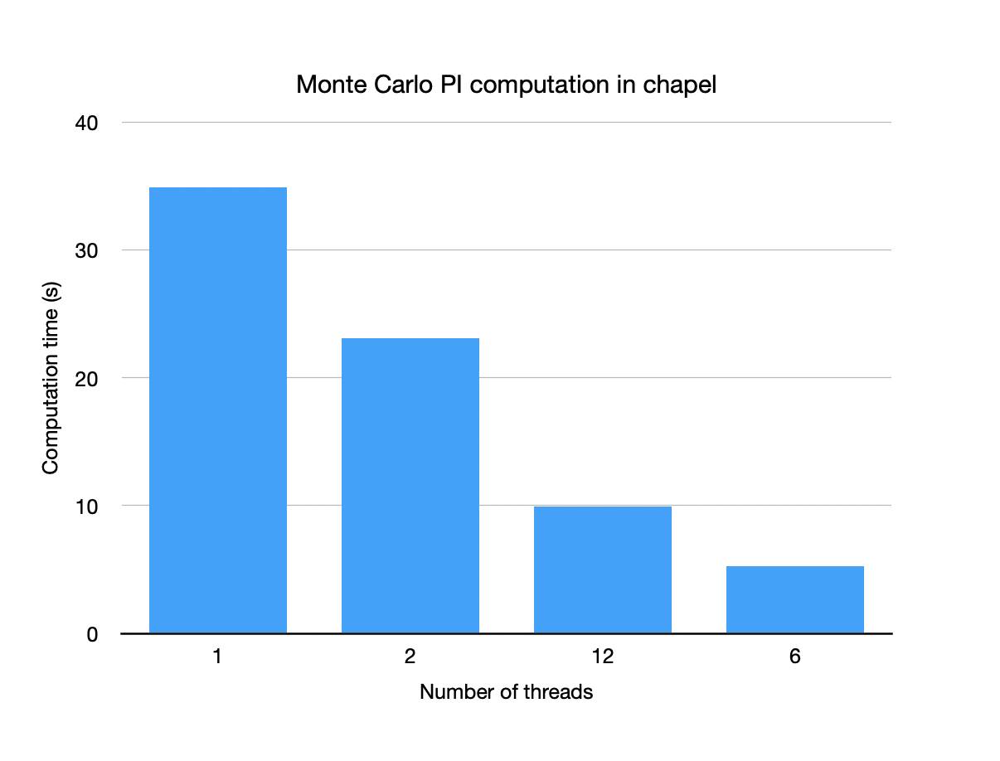
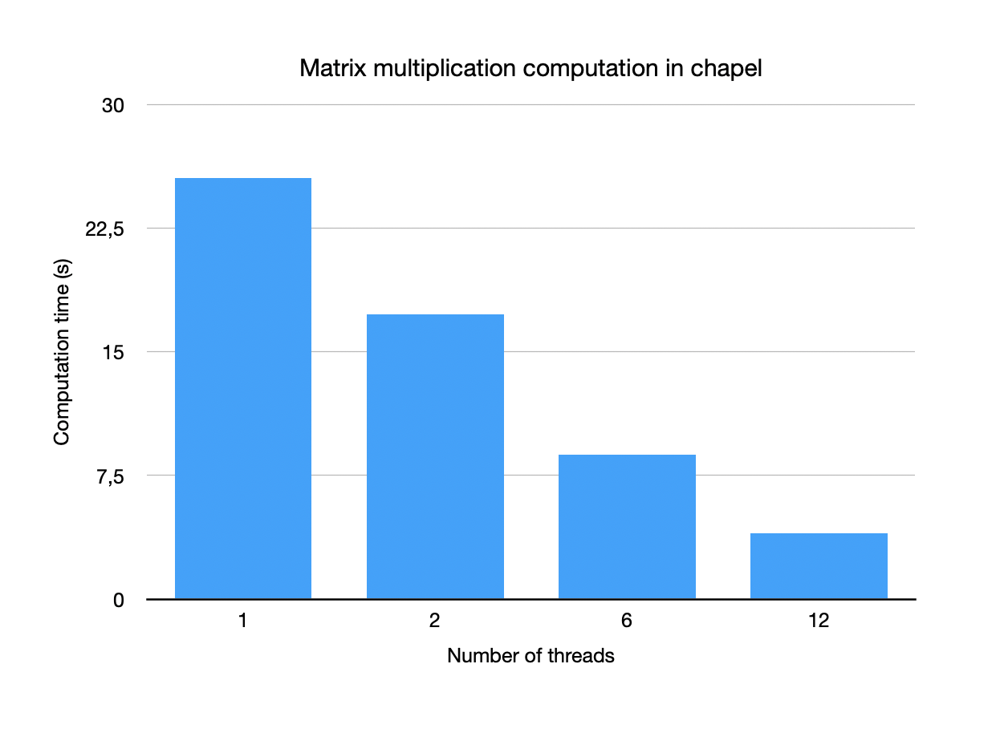
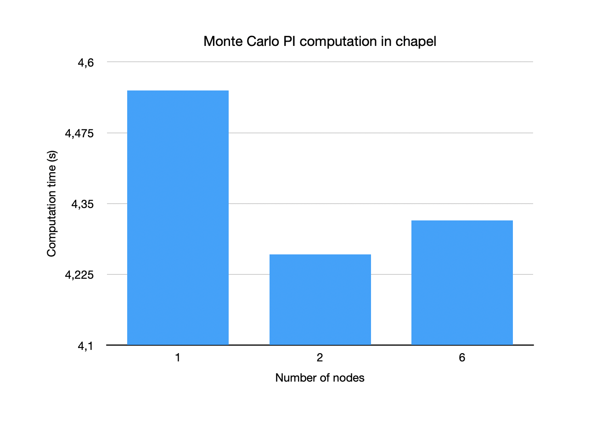
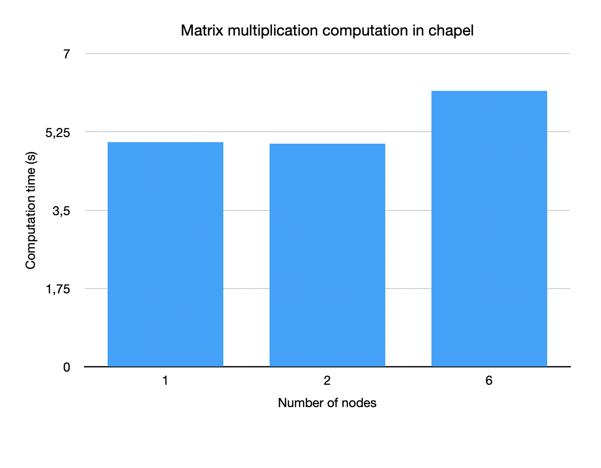

### Team: Peter Burger, Leo Schmid, Fabian Aster, Marko Zaric


# Chapel

## Exercise 01

### Chapel installation on LCC3

https://chapel-lang.org/docs/usingchapel/QUICKSTART.html

```
wget https://github.com/chapel-lang/chapel/releases/download/1.33.0/chapel-1.33.0.tar.gz
tar -xzf chapel-1.33.0.tar.gz
cd chapel-1.33.0/
source util/quickstart/setchplenv.bash
make
```





Specifying the number of threads for running benchmarks works by setting `CHPL_RT_NUM_THREADS_PER_LOCALE=<numThreads>` to the desired number. We noticed that we have to increase the number by one, otherwise a deadlock is created when running the program with only one thread. In addition setting the environment variable to `13` leads to the same result when omitting to set the value. 




## Exercise 02

```
export CHPL_COMM=gasnet
export CHPL_LAUNCHER=gasnetrun_mpi
export CHPL_COMM_SUBSTRATE=mpi
export CHPL_TARGET_CPU=westmere
module load openmpi/3.1.6-gcc-12.2.0-d2gmn55
export MPI_CC=/usr/site/hpc/spack/v0.19-lcc3-20230919/opt/spack/linux-rocky8-westmere/gcc-12.2.0/openmpi-3.1.6-d2gmn55g7hoinwfuk2lc3ibz6odzujak/bin/mpicc
CHPL_TARGET_CPU=westmere
cd $CHPL_HOME
make
cd ~/uibk-hpc/week11
make
```



For both programs the parallelism did not work as expected. This is probably caused by configuring chapel falsely, since the speedup is reasonable when running the two programs on a single node (see exercise 01). Benchmarking the distributed memory version even results in a higher computation time when running on more nodes.


