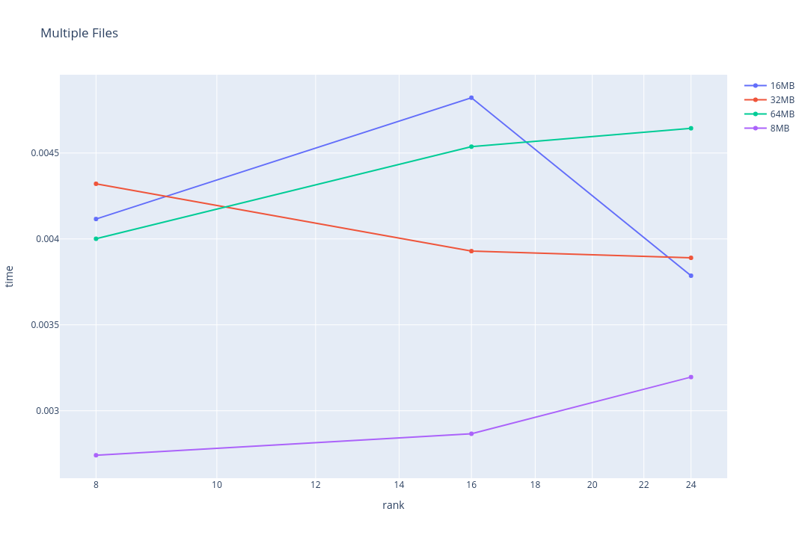
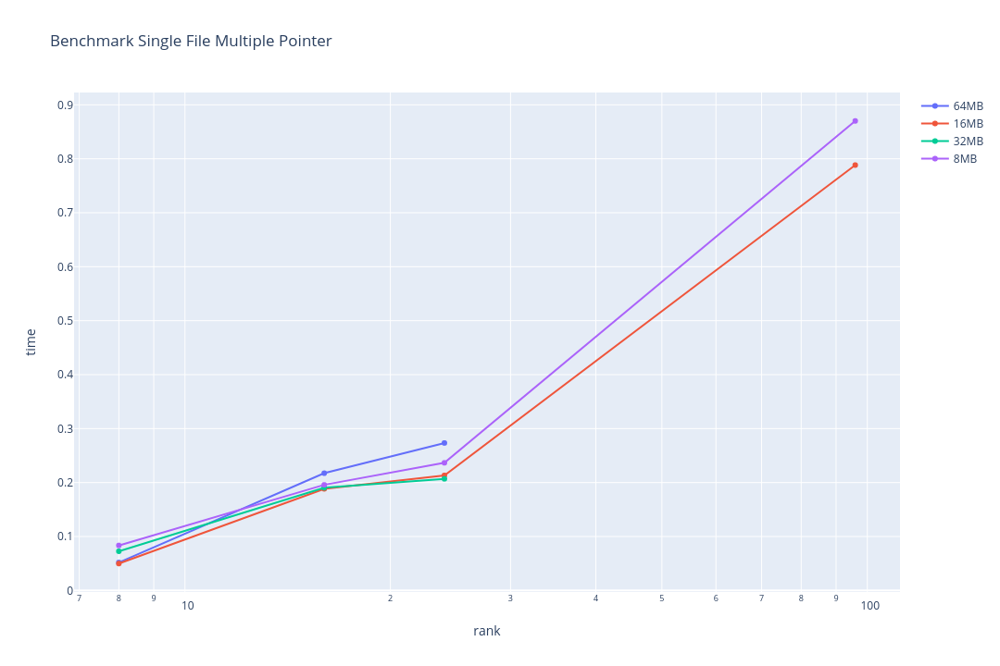
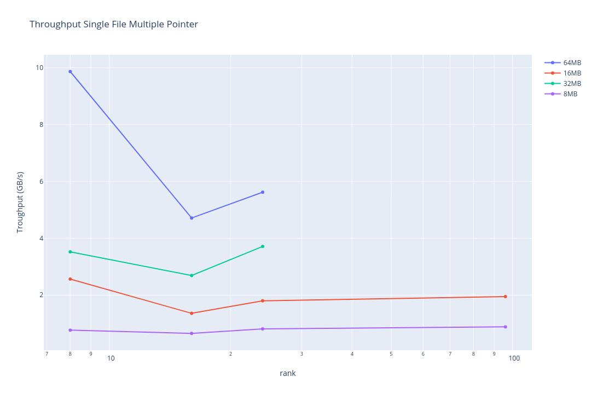
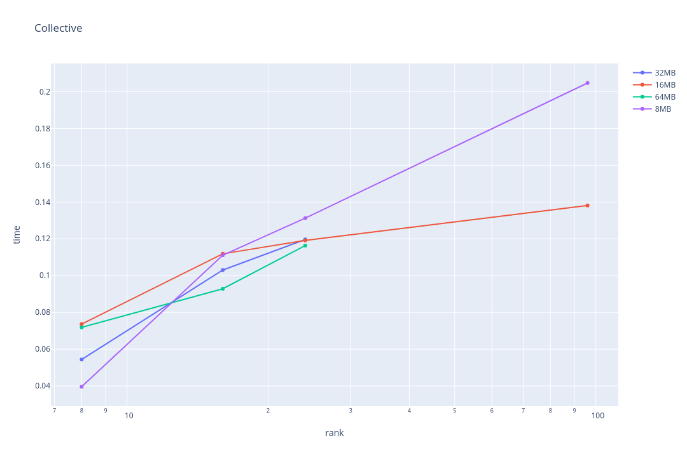
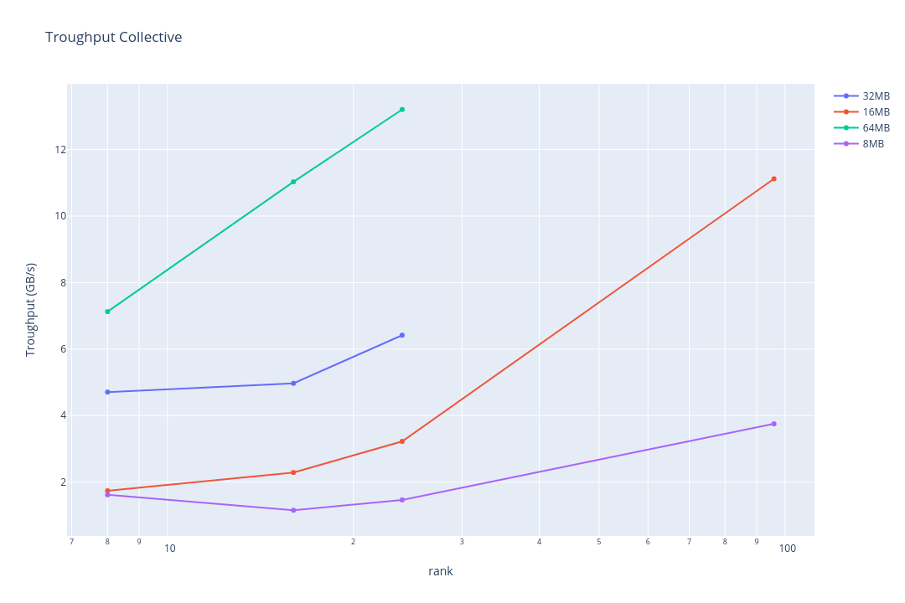
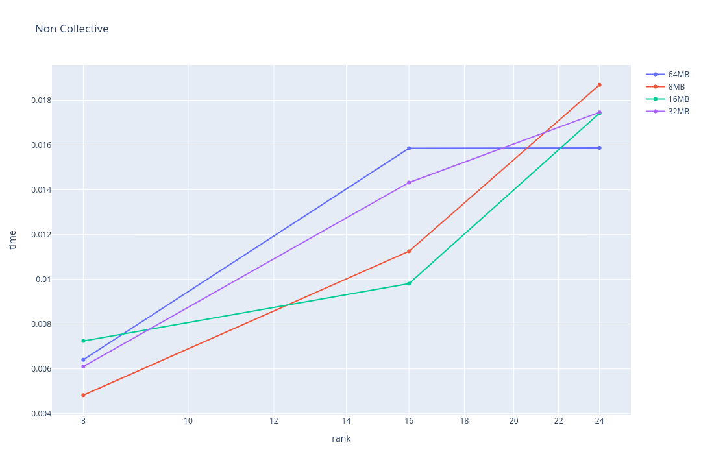
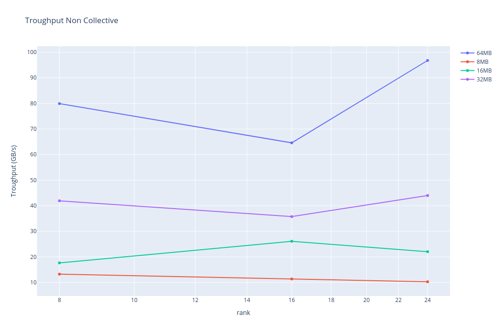
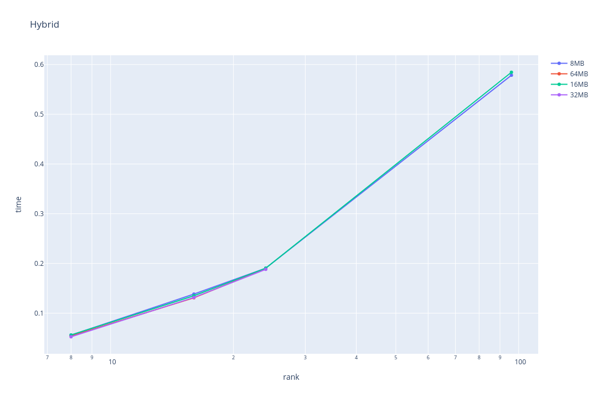
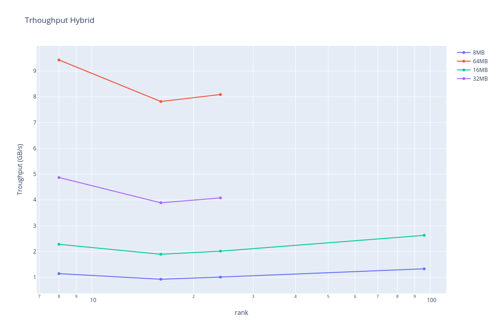

### Team: Peter Burger, Leo Schmid, Fabian Aster, Marko Zaric

The missing points are due to the overfull cluster

## Multiple Files

### Time 

### Troughput

## Single File Multiple Pointer

### Time 

### Troughput

## Collective

### Time 

### Troughput

## Non Collective

### Time 

### Troughput

## Hybrid

### Time 

### Troughput

