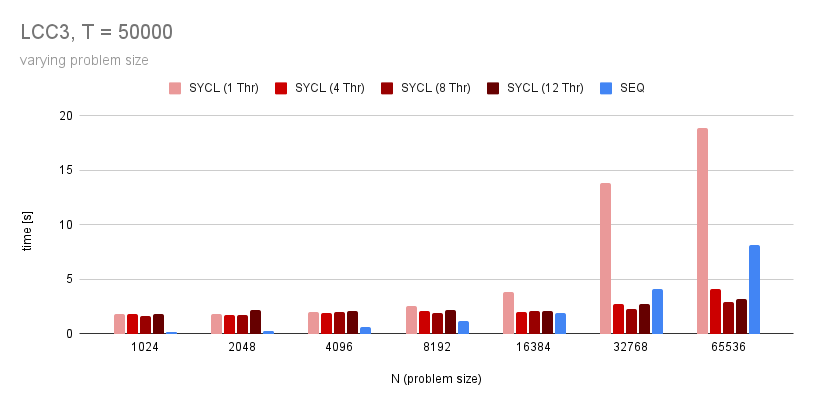
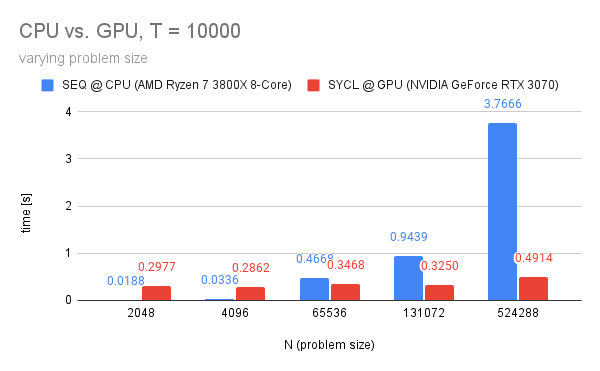
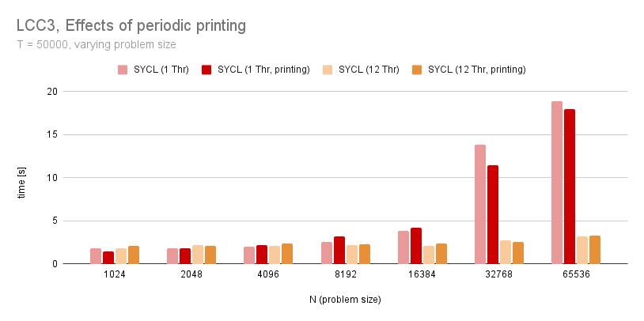

### Team: Peter Burger, Leo Schmid, Fabian Aster, Marko Zaric

# Assignment 13

## Build

```
module purge && module load llvm/15.0.4-python-3.10.8-gcc-8.5.0-bq44zh7
mkdir build && cd build
cmake .. -DCMAKE_PREFIX_PATH="/scratch/c703429/software/adaptivecpp/lib/cmake/AdaptiveCpp/"
make -j2
```

## Exercise 1 - SYCL port

### Observations - LCC3 (OpenMP backend)



For smaller problem sizes `N`, the sequential implementation is faster. But for `N >= 32768`, the SYCL version with `number of threads >= 4` is faster than the sequential implementation. 

There appears to be a huge communication overhead in the SYCL version. For `N = 1024`, the sequential implementation finishes almost instantly, however, the SYCL version already requires several seconds. In the SYCL version, the increase in problem size is only noticeable at `N = 32768`.

Reducing the number of iterations `T` would decrease the communication overhead, making the SYCL version already faster for smaller values of `N`.

There is a strange correlation between the number of threads and execution time. It looks like going from 1 thread to 4 or 8 threads results in better performance. However, executing with 12 threads is often slower than 8 threads. Since a single node in LCC3 has 12 hardware threads in total, in that case there might be more context switches. Could that be the reason?

The SYCL version running on one thread is substantially slower than the sequential version. For smaller `N`, this is probably attributed to the communication overhead. However, there appears to be a super-linear increase in execution time from `N = 16384` to `N = 32768`. The reason for that is unclear.

### Observations - GPU backend



When running the SYCL implementation on an actual GPU, the communication overhead becomes even more apparent. For problem sizes `N <= 131072` there is almost no notable difference in execution time when running on a GPU. This leads to believe that, again, the program spends most of its time communicating the with GPU rather than actually computing. Only at `N = 524288` we can see the effect of the increased problem size, although still small.

The sequential implementation running on the CPU behaves as expected. It does not suffer from communication overhead, so it is a lot faster for smaller `N`. At `N => 65536` however, the SYCL version running on the GPU is faster. The difference becomes even more noticeable for larger `N`.

## Exercise 2 - Periodic Printing

### Observations - LCC3 (OpenMP backend)



From the graph one might conclude that periodic printing has an impact on the execution time, especially for larger problem sizes. However, this impacts is minimal. Since execution time for the same parameters varies a lot, it is likely that it has a larger impact than the printing itself.
